# Google Photos Archiver Setup Instructions
If you are having trouble with any of the steps, feel free to email me.
If you are having any issues with the program or would like a new feature please submit an issue or pull request on my GitHub page.

dunkindawson (at) gmail (dot) com

## Open the Google API Console
https://console.cloud.google.com/ Agree to TOS and continue.
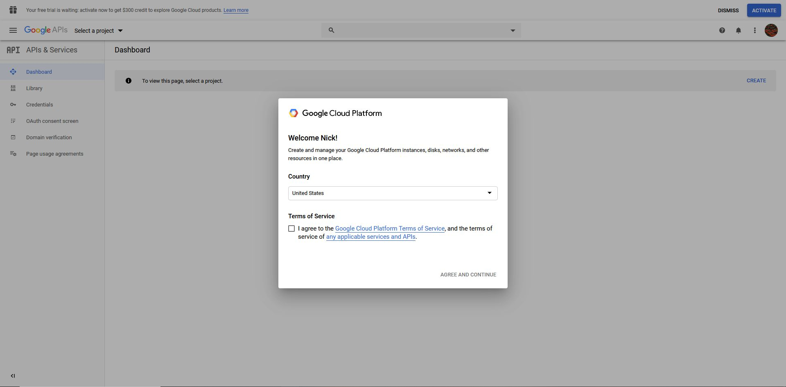

## Click the “Select a project” dropdown

## Click “New Project”
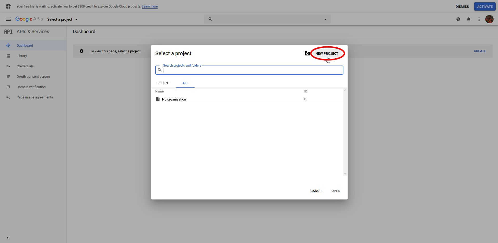

## Type a name for your project, and keep location as “No organization”. Click “Create”

## Wait for your project to be created 
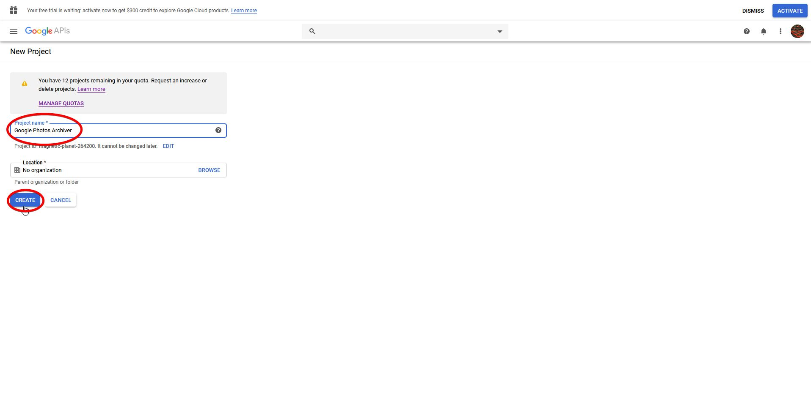

## Click “Enable APIs and Services” to view a dropdown menu

## Sarch “Photos Library API” and click on the Photos Library API card
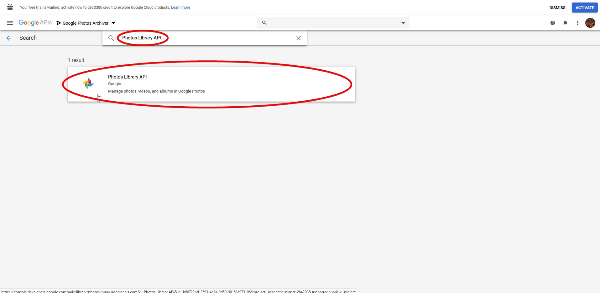

## Click “Enable” to enable the API on this project

## Once the API is loaded, click “Credentials”

## Click on “Create Credentials”
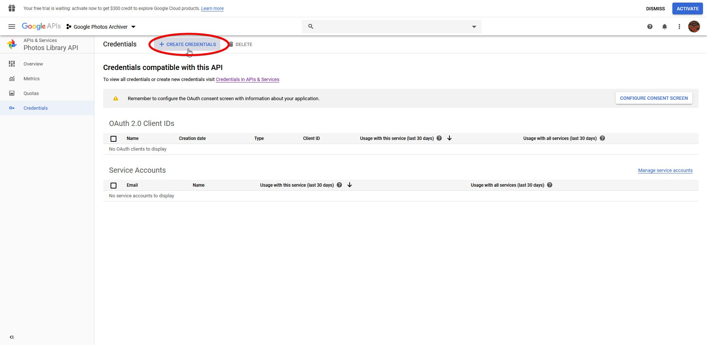

## Select “OAuth client ID” from the dropdown

## Select “Desktop app” in the dropdown
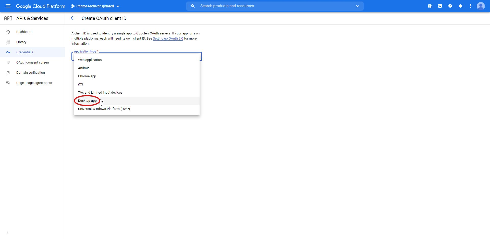

## Leave the name as is, click “Create”

## You will now see this screen, just hit OK
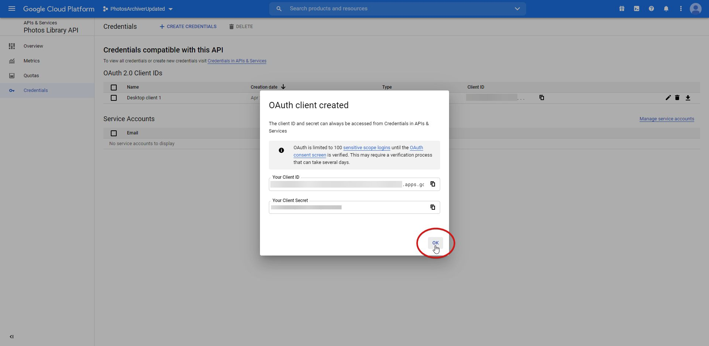

## This will download the credentials.json file which you need to access the api from my program. Save it and locate the file.

## Once downloaded, rename the file to “credentials”. Ensure the file extension is “.json”

## Move the “credentials.json” to the same folder as the Google Photos Archiver you downloaded from GitHub.
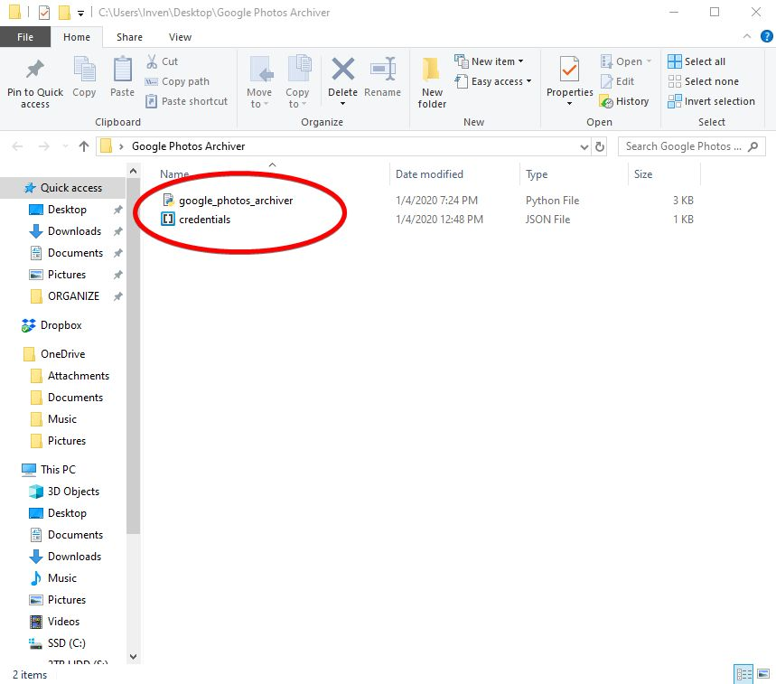

## Now we need to edit the client to enable a Google Account to use this API.
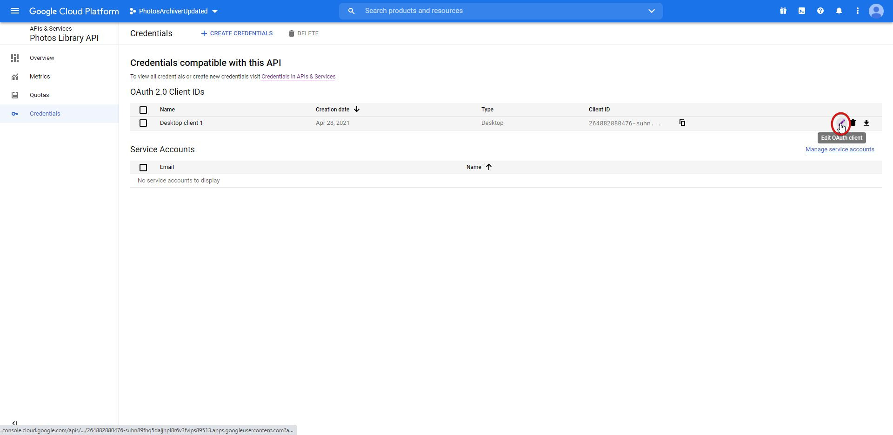

## On the edit screen click on the OAuth consent screen tab
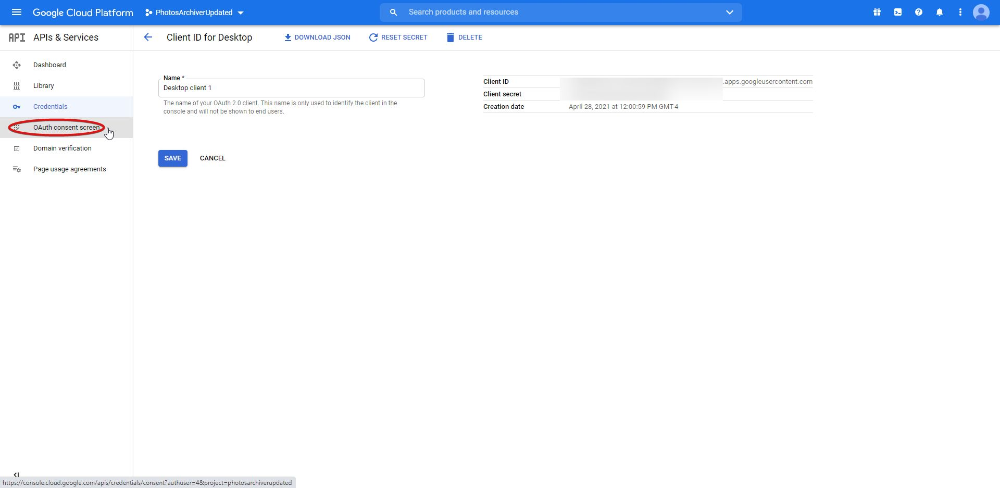

## Scroll down a bit to see “Test users”, click Add Users

## Type in the address of the account with the photos you want to archive, feel free to repeat this for as many accounts as you want.

## After clicking save and adding the users you want, run the program the program by double clicking it. You can run either the python program or the 64bit executable.
The program should open a link in your web browser or you should see a link and open the link in your browser.

## Choose your Google account with your photos on it.
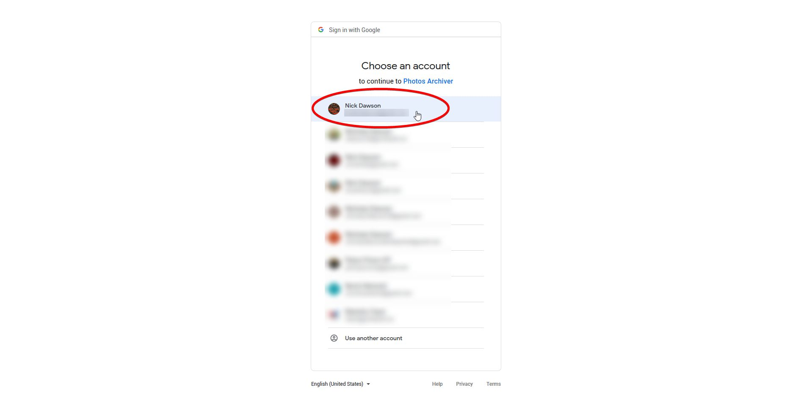

## You will see this prompt that says the app isn’t verified. This is a security precaution because you just made a simple API application that isn’t verified. Don’t worry, it doesn’t need to be verified. Just click “continue”
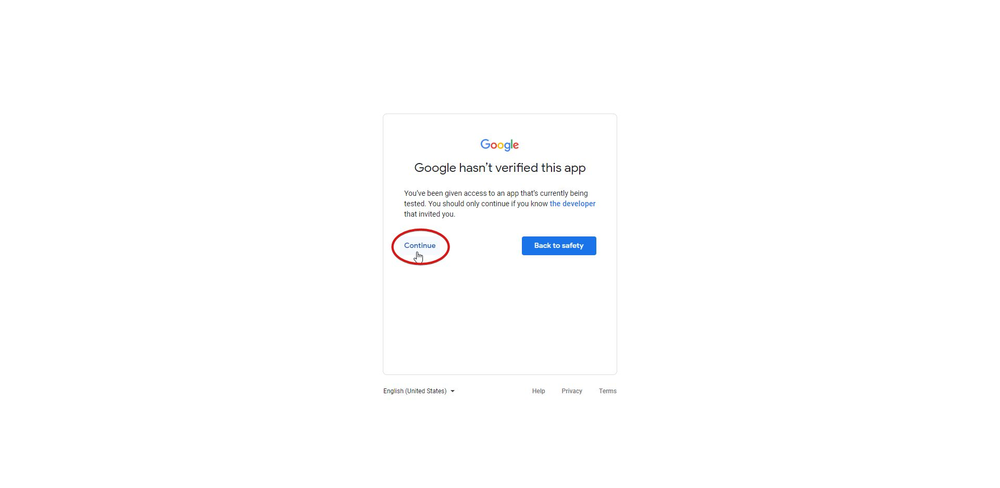

## Click allow to grant your application access to your Google Photos library.

## Ensure the checkbox is checked, and click allow.

## You will see this message when everything is complete. Return to the application and close this window.
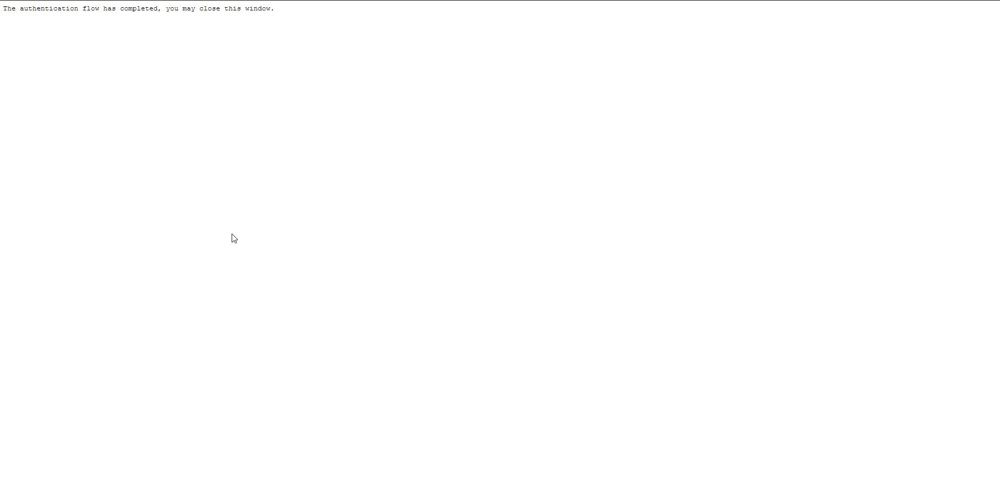

## Finished
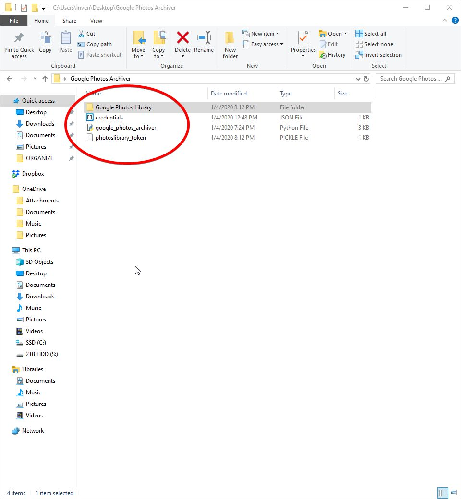

The program should be running and you should see a folder appear that is named “Google Photos Library”. In the command prompt window, you will see the the downloads happening. The program will close when everything is downloaded. Keep in mind, Google has limits on their API which most likely won’t be reached. You can only download 75,000 media items per day. The download process may take a long time depending on how big your media library is. My library was about 6000 photos and videos and it took about 1-2 hrs.
